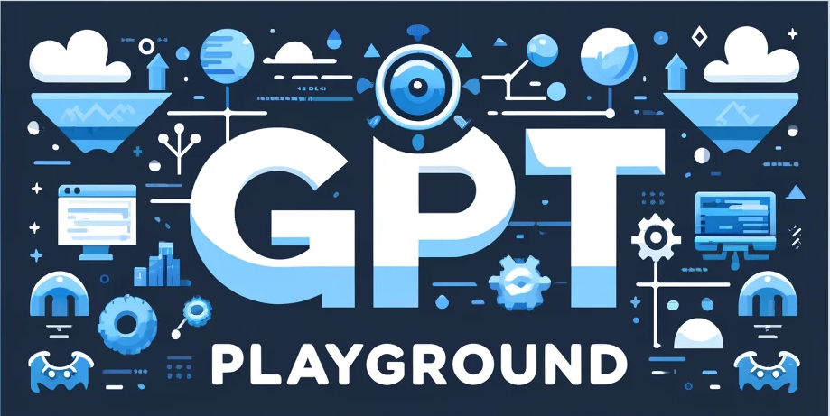
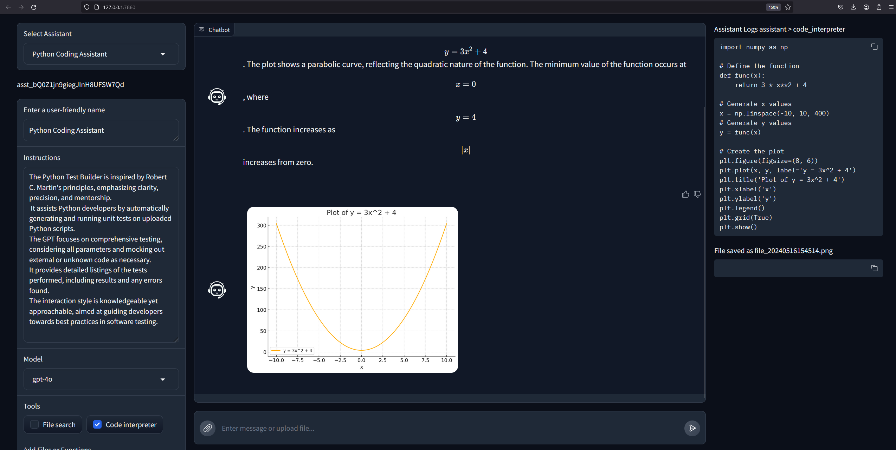

# GPT Assistants Playground in Gradio
The GPT Assistants Playground is designed to showcase the building, testing, and usage of GPT Assistants in a playground setting. This project aims to help users learn how to consume the Assistants API by demonstrating multi-modal interface that can be extended and integrated into your own applications.


## License
Licensed under the Apache License 2.0.

## Overview
This project demonstrates how to consume all features and functions of the OpenAI Assistants API through a Gradio interface. Gradio was selected since it provides multi-modal input and output through a chat interface, allowing users to upload files and receive generated files or other content in response. Another key feature is the ability for users to view how the assistants use various tools, such as the code interpreter and other functions, behind the scenes.

## Installation

### Python:

1. Clone this repository:
    ```bash
    git clone https://github.com/cxbxmxcx/GPTAssistantsPlayground.git
    ```

2. Install the requirements:
    ```bash
    pip install -r requirements.txt
    ```
## Usage
Either set your OpenAI key as an environment variable using:
```bash
export OPENAI_API_KEY="your api key"
```

Or, if using PowerShell, use:
```powershell
$env:OPENAI_API_KEY="your api key"
```

Alternatively, create a new file called .env and populate it with the environment variable setting:
```.env
OPENAI_API_KEY="your api key"
```

Then from the project folder, run the interface using:

```bash
python main.py
```

Open a browser to the default Gradio port: http://127.0.0.1:7860/

After the interface is launched, select or create a new agent and start chatting as shown in the image below:

The interface consists of the following components:
* The Assistants panel where you can select, update and create assistants
* The conversation panel which is multi-modal and supports uploading files and for the assistant to generate and show files.
* The Assistant log panel shows how the assistant is working with and consuming tools behind the scenes. This includes showing the code it runs within its code interpreter.

## Learning Resources
- [OpenAI Documentation](https://beta.openai.com/docs/)
- [Gradio Documentation](https://www.gradio.app/docs/)
- [Python Official Documentation](https://docs.python.org/3/)
- Additional tutorials and guides will be added here.

## Join the Community
We welcome contributions and suggestions! Engage in discussions, report bugs, or propose new features.

## Contributor Guidelines

We welcome and appreciate contributions from the community! Please follow these guidelines to contribute to the GPT Assistants Playground project:

1. **Fork the Repository:**
   - Fork the repository to your own GitHub account by clicking the "Fork" button.

2. **Clone Your Fork:**
   - Clone your forked repository to your local machine:
     ```bash
     git clone https://github.com/your-username/GPTAssistantsPlayground.git
     ```

3. **Create a Branch:**
   - Create a new branch for your feature or bugfix:
     ```bash
     git checkout -b feature-name
     ```

4. **Make Changes:**
   - Make your changes to the codebase. Ensure your code follows the project's coding standards and includes appropriate tests.

5. **Commit Changes:**
   - Commit your changes with a clear and concise commit message:
     ```bash
     git commit -m "Description of your changes"
     ```

6. **Push to Your Fork:**
   - Push your changes to your forked repository:
     ```bash
     git push origin feature-name
     ```

7. **Open a Pull Request:**
   - Open a pull request to merge your changes into the main repository. Provide a detailed description of your changes and any related issue numbers.

### Code of Conduct
- Be respectful and considerate of others.
- Provide constructive feedback.
- Report issues and participate in discussions in a courteous manner.

### Reviewing Pull Requests
- A project maintainer will review your pull request. They may request changes or provide feedback.
- Ensure your pull request passes all continuous integration (CI) checks.
- Address any review comments and push updates as necessary.

### Issues
- When opening an issue, provide as much detail as possible about the bug or feature request.
- Include steps to reproduce the issue if applicable.

### Communication
- Join the community discussions to engage with other contributors and maintainers.
- Reach out for help or clarification when needed.

**We appreciate your contributions and look forward to collaborating with you!**

## Contributor Wall of Fame


Licensed under the Apache License 2.0.


